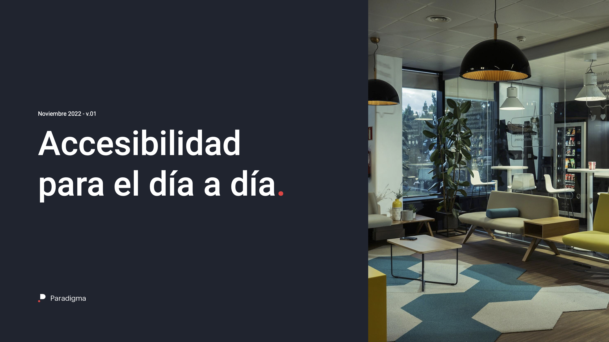
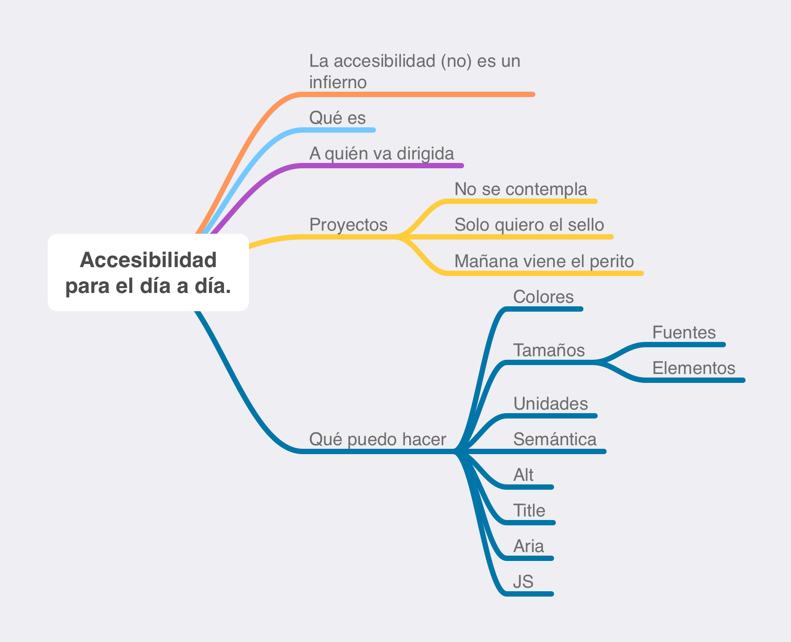
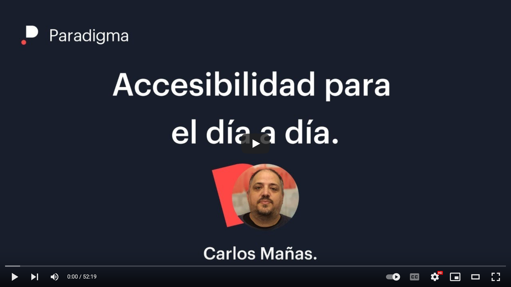

# Accesibilidad para el día a día

Slides del webinar "Accesibilidad para el día a día" en Paradigma Digital con motivo del día internacional de la usabilidad.

[PDF 1.7 MB](https://github.com/oneeyedman/accesibilidad-para-el-dia-a-dia/raw/main/dist/accesibilidad-para-el-dia-a-dia.pdf).

## Esquema
  
[PDF 19 KB](https://github.com/oneeyedman/accesibilidad-para-el-dia-a-dia/raw/main/dist/esquema.pdf).

## Video

Casi una hora.